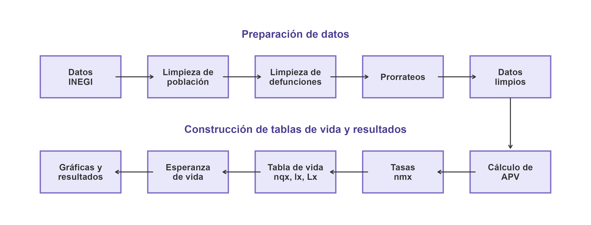
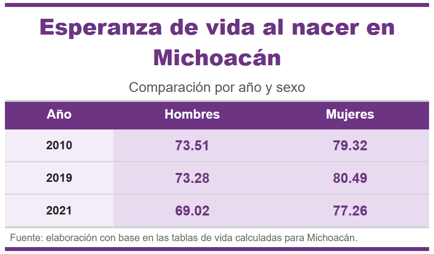
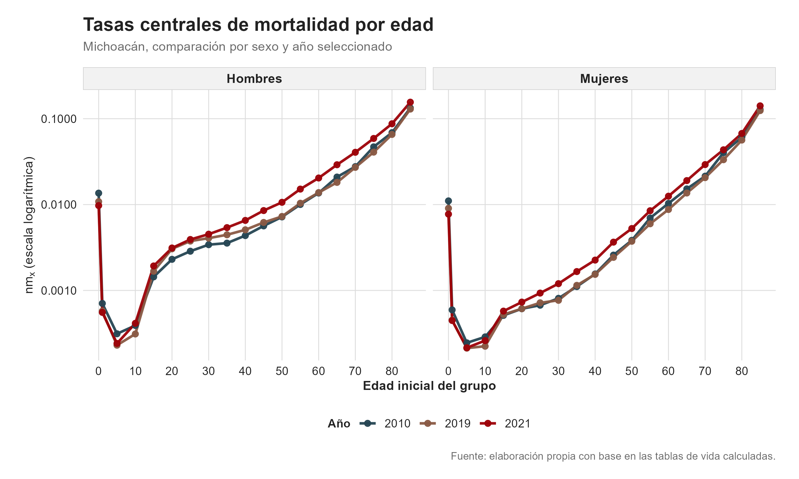
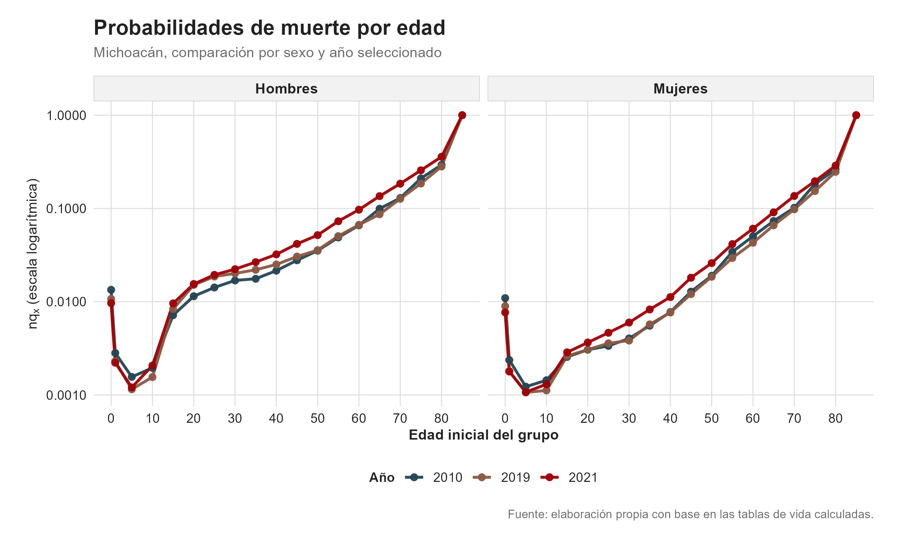
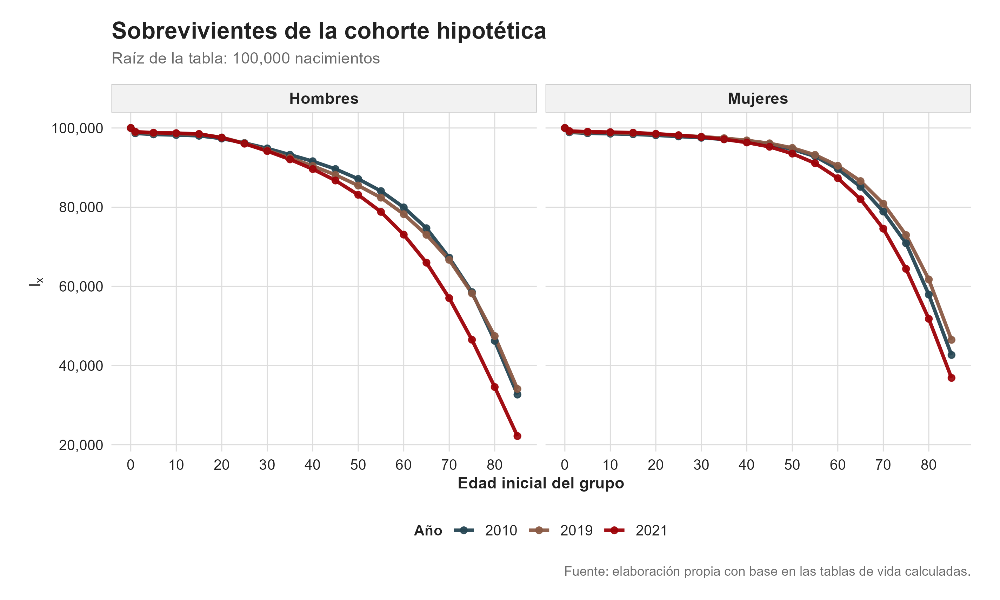
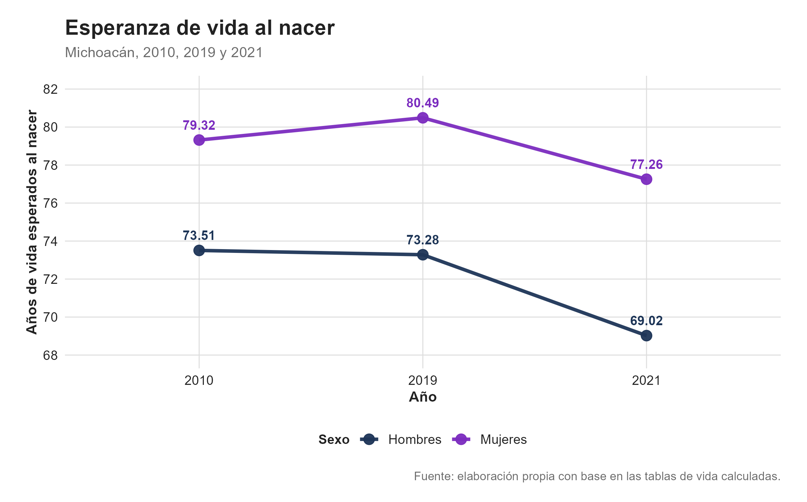
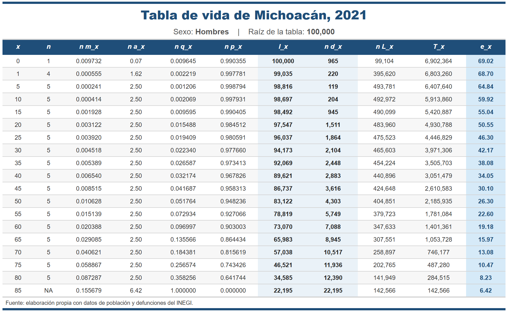
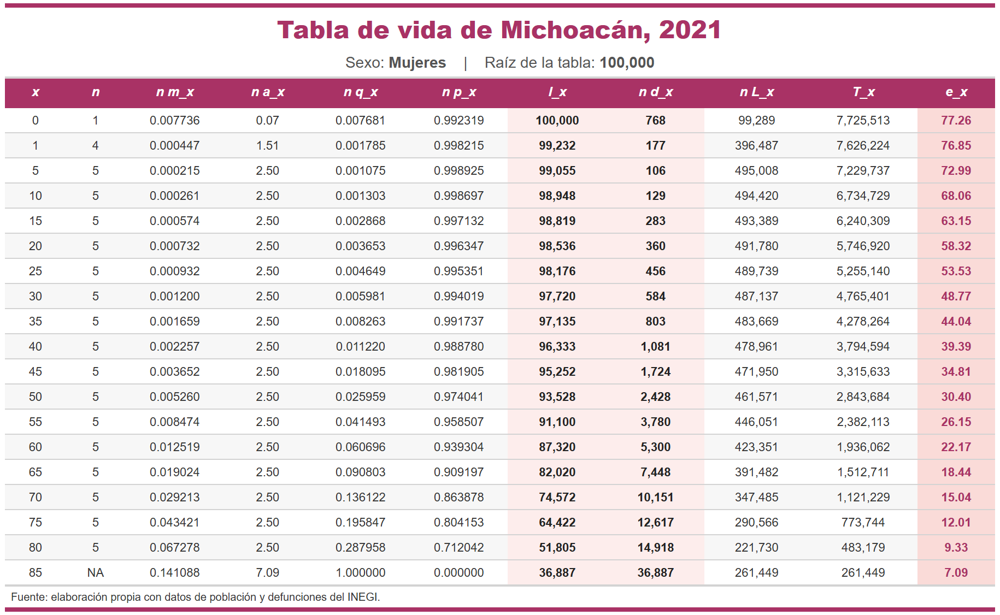
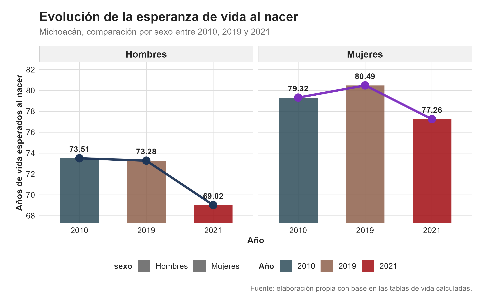

```{=latex}
\thispagestyle{empty}
\AddToHookNext{shipout/background}{
  \put(0in,-\paperheight){
    \includegraphics[width=\paperwidth,height=\paperheight]{data/Graficos/portada_michoacan.png}
  }
}
\null
\clearpage
```

```{=latex}
\tableofcontents
\clearpage
```

## a) Contexto de la entidad federativa

Michoacán de Ocampo es una entidad con una composición territorial y social diversa. En el mismo estado conviven zonas urbanas importantes, como Morelia, Uruapan, Zamora y Lázaro Cárdenas, con municipios rurales y localidades dispersas en regiones de montaña, costa y Tierra Caliente. Esta diversidad es relevante para el análisis demográfico porque puede relacionarse con diferencias en el acceso a servicios de salud, condiciones económicas, movilidad de la población y exposición a distintos riesgos de mortalidad.

De acuerdo con el Censo de Población y Vivienda 2020, Michoacán tenía 4,748,846 habitantes, de los cuales 51.4% eran mujeres y 48.6% hombres. Además, la edad mediana fue de 28 años. Esto muestra que la entidad conserva una estructura relativamente joven, pero al mismo tiempo presenta un proceso gradual de envejecimiento. Este aspecto es importante para construir e interpretar tablas de vida, ya que la mortalidad cambia de manera importante según la edad y suele concentrarse con mayor fuerza en los grupos de edades avanzadas.

Un indicador que ayuda a observar este cambio es el índice de envejecimiento. En Michoacán, dicho índice pasó de 33.67 personas de 65 años y más por cada 100 menores de 15 años en 2010 a 46.34 en 2020. Este aumento indica que la población adulta mayor ha ganado peso relativo dentro de la estructura poblacional. Por sexo, el envejecimiento fue mayor en mujeres, pues el índice pasó de 36.04 a 49.81, mientras que en hombres aumentó de 31.35 a 42.95. Esta diferencia es importante porque puede reflejarse en los niveles de mortalidad y en la esperanza de vida por sexo.

Otro elemento relevante es la desigualdad territorial. Michoacán cuenta con municipios con condiciones sociales y económicas distintas, lo cual puede influir indirectamente en la mortalidad. Factores como el nivel de marginación, la dispersión de localidades, el acceso a servicios de salud, la escolaridad y el ingreso pueden afectar la prevención, atención y tratamiento de enfermedades. Por ello, al analizar la mortalidad estatal, no solo debe considerarse el número de defunciones, sino también las condiciones bajo las cuales vive la población.

La migración también es una característica importante de Michoacán. Históricamente, la entidad ha tenido una relación fuerte con la migración, especialmente hacia Estados Unidos. Este fenómeno puede modificar la estructura por edad y sexo, principalmente en edades laborales, y afectar la población expuesta al riesgo. Por esta razón, la migración debe tomarse en cuenta al interpretar las tasas de mortalidad y los cambios en la estructura poblacional.

Finalmente, el año 2021 debe analizarse con especial atención debido al impacto de la pandemia de COVID-19. En este proyecto se comparan los años 2010, 2019 y 2021. El año 2019 permite observar la situación inmediata previa a la pandemia, mientras que 2021 permite estudiar los cambios en la mortalidad durante la crisis sanitaria. Por ello, se espera que las tablas de vida reflejen un aumento en los niveles de mortalidad y una reducción en la esperanza de vida, con posibles diferencias entre hombres y mujeres.

## b) Diagrama de flujo del proceso

El siguiente diagrama resume el procedimiento seguido para construir las tablas de vida de Michoacán para los años 2010, 2019 y 2021, separadas por sexo.

```{r}
#| echo: false
#| message: false
#| warning: false
#| fig-align: center
#| out-width: "100%"


```

## c) Fórmulas utilizadas

Para construir las tablas de vida de Michoacán se siguió el procedimiento visto en clase para tablas de mortalidad abreviadas. Primero se calcularon los años persona vividos o población expuesta al riesgo; después se obtuvieron las tasas centrales de mortalidad y, a partir de ellas, las demás funciones de la tabla de vida.

### Crecimiento exponencial para estimar APV

Como solo se cuenta con población censal para 2010 y 2020, se estimó la población expuesta para los años de interés mediante crecimiento exponencial. La expresión utilizada fue:

$$
N(t)=N_0 e^{r(t-t_0)}
$$

donde (N(t)) es la población estimada en el tiempo (t), (N_0) es la población inicial, (t_0) es el año inicial y (r) es la tasa de crecimiento. Esta tasa se calculó como:

$$
r=\frac{\ln(N_T/N_0)}{t_T-t_0}
$$

donde (N_T) es la población final observada y (t_T) el año final. Con esta fórmula se estimaron los APV para 2010, 2019 y 2021 por edad y sexo.

### Tasa central de mortalidad

La tasa central de mortalidad se calculó como el cociente entre las defunciones y los años persona vividos:

$$
{}_nm_x = \frac{{}_nD_x}{{}_nAPV_x}
$$

donde ({}\_nD_x) representa las defunciones ocurridas entre las edades (x) y (x+n), y ({}\_nAPV_x) representa la población expuesta al riesgo en ese mismo intervalo.

### Promedio de años vividos por quienes fallecen

El término ({}\_n a_x) representa el promedio de años vividos dentro del intervalo por las personas que fallecieron entre las edades (x) y (x+n). Para los grupos de edad de 5 años en adelante se utilizó:

$$
{}_na_x = \frac{n}{2}
$$

Para la edad 0 y el grupo 1 a 4 años se utilizaron las fórmulas de Coale y Demeny vistas en clase, diferenciadas por sexo.

Para hombres se usó:

$$
a_0 = 0.330 \quad \text{si } m_0 \geq 0.107
$$

$$
a_0 = 0.045 + 2.684m_0 \quad \text{si } m_0 < 0.107
$$

$$
a_1 = 1.352 \quad \text{si } m_0 \geq 0.107
$$

$$
a_1 = 1.651 - 2.816m_0 \quad \text{si } m_0 < 0.107
$$

Para mujeres se usó:

$$
a_0 = 0.350 \quad \text{si } m_0 \geq 0.107
$$

$$
a_0 = 0.053 + 2.800m_0 \quad \text{si } m_0 < 0.107
$$

$$
a_1 = 1.361 \quad \text{si } m_0 \geq 0.107
$$

$$
a_1 = 1.522 - 1.518m_0 \quad \text{si } m_0 < 0.107
$$

### Probabilidad de muerte

La probabilidad de morir entre las edades (x) y (x+n) se obtuvo con:

$$
{}_nq_x =
\frac{n \cdot {}_nm_x}
{1 + (n - {}_na_x)\cdot {}_nm_x}
$$

Para el grupo abierto final se supuso:

$$
{}_{\omega}q_x = 1
$$

### Probabilidad de sobrevivencia

La probabilidad de sobrevivir entre las edades (x) y (x+n) se calculó como:

$$
{}_np_x = 1 - {}_nq_x
$$

### Sobrevivientes

Se tomó una raíz de la tabla de vida de:

$$
l_0 = 100000
$$

A partir de esta raíz, los sobrevivientes a cada edad se calcularon de forma recursiva:

$$
l_{x+n} = l_x \cdot {}_np_x
$$

### Defunciones de la cohorte hipotética

Las defunciones entre las edades (x) y (x+n) se calcularon como:

$$
{}_nd_x = l_x \cdot {}_nq_x
$$

De manera equivalente:

$$
{}_nd_x = l_x - l_{x+n}
$$

### Años persona vividos en la tabla de vida

Los años persona vividos entre las edades (x) y (x+n) se calcularon con:

$$
{}_nL_x = n \cdot l_{x+n} + {}_na_x \cdot {}_nd_x
$$

Para el grupo abierto final se utilizó:

$$
{}_{\omega}L_x = \frac{l_x}{{}_{\omega}m_x}
$$

### Años persona por vivir

El total de años persona que les resta vivir a los sobrevivientes de edad exacta (x) se obtuvo acumulando los ({}\_nL_x) desde la última edad hacia atrás:

$$
T_x = \sum_{y=x}^{\omega} {}_nL_y
$$

### Esperanza de vida

Finalmente, la esperanza de vida a la edad exacta (x) se calculó como:

$$ e_x^0=\frac{T_x}{l_x} $$

En particular, la esperanza de vida al nacer corresponde a:

$$ e_0^0=\frac{T_0}{l_0} $$

Este indicador resume el nivel de mortalidad de cada año y sexo, bajo el supuesto de que una cohorte hipotética estuviera expuesta durante toda su vida a las condiciones de mortalidad observadas en el periodo analizado.

## d) Código utilizado para los cálculos

El código del proyecto se organizó en scripts separados para que el procedimiento fuera más claro y replicable. Todos los archivos se encuentran en la carpeta `script/` del repositorio. El informe se genera a partir del archivo Quarto y ejecuta los scripts en el siguiente orden:

```{r}
#| eval: false

source("script/00_config.R")
source("script/01_poblacion.R")
source("script/02_defunciones.R")
source("script/03_apv.R")
source("script/04_tablas_vida.R")
source("script/05_graficas.R")
source("script/06_exportar_tablas_vida.R")
source("script/07_tablas_vida_visuales.R")
```

El archivo `00_config.R` define las rutas, los años de análisis, la entidad federativa y los paquetes necesarios. También permite que el proyecto sea replicable desde una misma estructura de carpetas.

```{r}
#| eval: false

ruta_data <- "data/"
ruta_scripts <- "script/"
ruta_graficos <- "output/"

entidad_objetivo <- "Michoacán de Ocampo"

anios_objetivo <- c(2010, 2019, 2021)

anios_defunciones <- c(2009, 2010, 2011,
                       2018, 2019,
                       2020, 2021, 2022)

l0 <- 100000
```

El archivo `01_poblacion.R` limpia la población censal de 2010 y 2020, agrupa las edades en intervalos compatibles con una tabla de vida abreviada y prorratea la población con edad no especificada.

```{r}
#| eval: false

poblacion_2010 <- leer_poblacion(archivo_poblacion_2010, 2010)
poblacion_2020 <- leer_poblacion(archivo_poblacion_2020, 2020)

poblacion <- rbind(poblacion_2010, poblacion_2020)
```

El archivo `02_defunciones.R` limpia las defunciones registradas, trabaja con el año de ocurrencia, agrupa por edad y sexo, prorratea el sexo no especificado y construye los años de referencia del proyecto.

```{r}
#| eval: false

def_long[, anio := case_when(
  anio_ocurrencia %in% c(2009, 2010, 2011) ~ 2010,
  anio_ocurrencia %in% c(2018, 2019) ~ 2019,
  anio_ocurrencia %in% c(2020, 2021, 2022) ~ 2021,
  TRUE ~ NA_real_
)]

defunciones <- def_long[
  !is.na(anio),
  .(defunciones = mean(defunciones, na.rm = TRUE)),
  by = .(anio, sexo, edad)
]
```

El archivo `03_apv.R` estima los años persona vividos mediante crecimiento exponencial entre la población censal de 2010 y 2020.

```{r}
#| eval: false

expo <- function(N0, NT, t0, tT, t) {
  t0_dec <- fecha_decimal(t0)
  tT_dec <- fecha_decimal(tT)
  
  r <- log(NT / N0) / (tT_dec - t0_dec)
  h <- t - t0_dec
  
  Nt <- N0 * exp(r * h)
  
  return(Nt)
}
```

El archivo `04_tablas_vida.R` une defunciones y APV, calcula las tasas centrales de mortalidad y construye las seis tablas de vida.

```{r}
#| eval: false

base_tabla <- merge(
  apv,
  defunciones,
  by = c("anio", "sexo", "edad"),
  all.x = TRUE
)

base_tabla[, mx := defunciones / APV]
```

La función principal de este script calcula las funciones de la tabla de vida: (nmx), (nax), (nqx), (npx), (lx), (ndx), (nLx), (Tx) y (ex).

```{r}
#| eval: false

qx <- (n * mx) / (1 + (n - ax) * mx)
qx[length(qx)] <- 1

px <- 1 - qx

lx <- numeric(length(x))
lx[1] <- l0

for (i in 2:length(lx)) {
  lx[i] <- lx[i - 1] * px[i - 1]
}

dx <- lx * qx
```

Finalmente, los scripts `05_graficas.R`, `06_exportar_tablas_vida.R` y `07_tablas_vida_visuales.R` generan las gráficas del informe, exportan las seis tablas finales en CSV y producen versiones visuales en imagen para facilitar la revisión rápida de resultados.

## e) Esperanza de vida al nacer por sexo y año

La esperanza de vida al nacer resume el nivel de mortalidad de cada año y sexo. En este proyecto se obtiene a partir de las tablas de vida construidas para Michoacán, tomando el valor de (e_0\^0), es decir, la esperanza de vida a la edad exacta cero.

```{r}
#| echo: false
#| message: false
#| warning: false
#| fig-align: center
#| out-width: "75%"


```

El cuadro permite comparar la evolución de la esperanza de vida antes y durante el periodo de pandemia. En particular, el año 2019 funciona como referencia previa a la crisis sanitaria, mientras que 2021 permite observar el deterioro asociado al aumento de la mortalidad durante la pandemia de COVID-19.

## f) Gráficas del informe

A continuación se presentan las principales gráficas derivadas de las tablas de vida. Se muestran las tasas centrales de mortalidad ({}\_n m_x), las probabilidades de muerte ({}\_n q_x), la función de sobrevivientes (l_x) y la evolución de la esperanza de vida al nacer. Las gráficas de ({}\_n m_x) y ({}\_n q_x) se presentan en escala logarítmica, ya que esto permite observar con mayor claridad el patrón de mortalidad por edad.

```{r}
#| echo: false
#| message: false
#| warning: false
#| fig-align: center
#| out-width: "92%"


```

La gráfica de ({}\_n m_x) muestra las tasas centrales de mortalidad por edad, sexo y año. Esta función permite observar cómo cambia la intensidad de la mortalidad a lo largo del ciclo de vida. En general, las tasas son menores en edades jóvenes y aumentan conforme avanza la edad.

```{r}
#| echo: false
#| message: false
#| warning: false
#| fig-align: center
#| out-width: "92%"


```

La gráfica de ({}\_n q_x) presenta las probabilidades de muerte por edad, sexo y año. Esta medida permite comparar directamente el riesgo de fallecer dentro de cada intervalo de edad. Al igual que con las tasas centrales de mortalidad, se observa un incremento importante en las edades avanzadas.

```{r}
#| echo: false
#| message: false
#| warning: false
#| fig-align: center
#| out-width: "92%"


```

La curva (l_x) representa el número de sobrevivientes de una cohorte hipotética de 100,000 nacimientos. Su descenso muestra cómo se va reduciendo la cohorte conforme avanza la edad. Esta función permite visualizar de forma más directa el efecto acumulado de la mortalidad.

```{r}
#| echo: false
#| message: false
#| warning: false
#| fig-align: center
#| out-width: "85%"


```

La gráfica de esperanza de vida al nacer resume los cambios en el nivel general de mortalidad. Esta comparación permite observar las diferencias entre hombres y mujeres, así como el cambio entre 2010, 2019 y 2021. En particular, el año 2021 muestra una reducción importante, asociada al aumento de la mortalidad durante el periodo de pandemia.

### Tablas de vida de 2021 por sexo

Además de las gráficas anteriores, se incluyen las tablas de vida correspondientes a 2021 para hombres y mujeres. Estas tablas permiten observar de forma detallada los componentes utilizados para describir el comportamiento de la mortalidad, como ({}\_n m_x), ({}\_n q_x), (l_x), ({}\_n d_x), ({}\_n L_x), (T_x) y (e_x). Por ello, complementan las gráficas y ayudan a revisar directamente los valores calculados para el año con mayor impacto en la mortalidad durante el periodo analizado.

```{r}
#| echo: false
#| message: false
#| warning: false
#| fig-align: center
#| out-width: "100%"


```

La tabla anterior muestra la tabla de vida para hombres en 2021. En ella se observa el comportamiento de la mortalidad por edad y el efecto acumulado sobre la cohorte hipotética de 100,000 nacimientos.

```{r}
#| echo: false
#| message: false
#| warning: false
#| fig-align: center
#| out-width: "100%"


```

La tabla anterior muestra la tabla de vida para mujeres en 2021. Su inclusión permite comparar los componentes de la tabla de vida entre sexos dentro del mismo año, manteniendo la misma estructura de cálculo y presentación.

## g) Análisis de resultados

A partir de las tablas de vida construidas para Michoacán en 2010, 2019 y 2021, se observa que la mortalidad presenta diferencias importantes por edad, sexo y año. En general, las funciones ({}\_n m_x) y ({}\_n q_x) muestran el comportamiento esperado: niveles relativamente altos en las primeras edades, una disminución durante la niñez y un aumento progresivo conforme avanza la edad. Este patrón indica que la mortalidad no se distribuye de manera uniforme, sino que se concentra con mayor intensidad en las edades adultas y, sobre todo, en las edades avanzadas.

Para resumir el cambio general en la mortalidad, se utiliza la esperanza de vida al nacer. Este indicador permite comparar de forma directa el nivel de mortalidad entre años y entre sexos, ya que concentra en un solo valor el efecto de las tasas de mortalidad observadas en todas las edades.

```{r}
#| echo: false
#| message: false
#| warning: false
#| fig-align: center
#| out-width: "85%"


```

Entre 2010 y 2019, el comportamiento previo a la pandemia no fue igual para hombres y mujeres. En hombres, la esperanza de vida al nacer se mantuvo prácticamente estable, al pasar de 73.51 años en 2010 a 73.28 años en 2019. Esta ligera disminución sugiere que, antes de la pandemia, no hubo una mejora clara en el nivel general de mortalidad masculina. En cambio, en mujeres sí se observa una mejora: la esperanza de vida aumentó de 79.32 años en 2010 a 80.49 años en 2019. Esto confirma que, antes del choque sanitario, las mujeres mantenían una ventaja importante en supervivencia respecto a los hombres.

El cambio más fuerte aparece en 2021. En hombres, la esperanza de vida al nacer cayó de 73.28 años en 2019 a 69.02 años en 2021, es decir, una reducción aproximada de 4.26 años. En mujeres, la caída fue de 80.49 a 77.26 años, equivalente a una reducción aproximada de 3.23 años. Por lo tanto, aunque ambos sexos fueron afectados por el aumento de la mortalidad durante la pandemia, el deterioro fue más fuerte en hombres.

Este resultado es importante porque muestra que el impacto de la COVID-19 no solo se reflejó en un aumento de defunciones, sino también en una pérdida clara de años de esperanza de vida. En términos de las tablas de vida, esto significa que las probabilidades de muerte aumentaron lo suficiente como para reducir el número esperado de años por vivir desde el nacimiento. La reducción observada en 2021 es consistente con el efecto de la pandemia, especialmente porque el riesgo de muerte fue mayor en edades adultas y avanzadas, grupos que tienen un peso importante en el cálculo de la esperanza de vida.

Al analizar las diferencias por sexo, se mantiene la ventaja femenina en los tres años estudiados. Las mujeres presentan mayor esperanza de vida que los hombres tanto en 2010 como en 2019 y 2021. Esta diferencia puede relacionarse con factores biológicos, sociales y de exposición a riesgos externos. En el caso de Michoacán, también deben considerarse elementos propios de la entidad, como la desigualdad territorial, la presencia de zonas rurales, diferencias en el acceso a servicios de salud, procesos migratorios y condiciones de violencia que pueden afectar con mayor fuerza a la población masculina joven y adulta. Estos factores ayudan a entender por qué la mortalidad masculina se mantiene más alta durante todo el periodo.

Las curvas de (l_x) también permiten interpretar el efecto acumulado de la mortalidad. Al partir de una cohorte hipotética de 100,000 nacimientos, la función (l_x) muestra cuántas personas sobreviven a cada edad. Cuando la mortalidad aumenta, la cohorte se reduce con mayor rapidez. Por ello, al comparar 2019 con 2021, el descenso más marcado de la supervivencia refleja condiciones de mortalidad más desfavorables durante el año afectado por la pandemia.

En conjunto, los resultados muestran tres aspectos centrales para Michoacán. Primero, antes de la pandemia la evolución fue desigual por sexo: las mujeres mejoraron su esperanza de vida, mientras que los hombres permanecieron casi sin avance. Segundo, la pandemia produjo una caída clara de la esperanza de vida en 2021, con un efecto más fuerte en hombres. Tercero, las diferencias entre hombres y mujeres se mantuvieron durante todo el periodo, lo que confirma la importancia de analizar la mortalidad por sexo y no solamente con cifras agregadas. Así, las tablas de vida permiten observar de manera ordenada cómo cambió la mortalidad en la entidad y cómo el año 2021 representó un deterioro importante respecto al periodo previo a la COVID-19.
