```{=latex}
\thispagestyle{empty}
\AddToHookNext{shipout/background}{
  \put(0in,-\paperheight){
    \includegraphics[width=\paperwidth,height=\paperheight]{data/Graficos/portada_michoacan.png}
  }
}
\null
\clearpage
```

```{=latex}
\tableofcontents
\clearpage
```

## a) Contexto de la entidad federativa

Michoacán de Ocampo es una entidad con una composición territorial y social diversa. En el mismo estado conviven zonas urbanas importantes, como Morelia, Uruapan, Zamora y Lázaro Cárdenas, con municipios rurales y localidades dispersas en regiones de montaña, costa y Tierra Caliente. Esta diversidad es relevante para el análisis demográfico porque puede relacionarse con diferencias en el acceso a servicios de salud, condiciones económicas, movilidad de la población, fecundidad y exposición a distintos riesgos de mortalidad.

De acuerdo con el Censo de Población y Vivienda 2020, Michoacán tenía 4,748,846 habitantes, de los cuales 51.4% eran mujeres y 48.6% hombres. Además, la edad mediana fue de 28 años. Esto muestra que la entidad conserva una estructura relativamente joven, aunque con un proceso gradual de envejecimiento. Este aspecto es importante porque la mortalidad cambia de manera considerable según la edad, mientras que la fecundidad se concentra principalmente en las edades reproductivas de las mujeres.

Un indicador que ayuda a observar este cambio es el índice de envejecimiento. En Michoacán, dicho índice pasó de 33.67 personas de 65 años y más por cada 100 menores de 15 años en 2010 a 46.34 en 2020. Por sexo, el envejecimiento fue mayor en mujeres, pues el índice pasó de 36.04 a 49.81, mientras que en hombres aumentó de 31.35 a 42.95. Esta diferencia puede reflejarse tanto en los niveles de mortalidad y esperanza de vida como en la interpretación de los indicadores de fecundidad y reemplazo generacional.

Otro elemento relevante es la desigualdad territorial. Michoacán cuenta con municipios con condiciones sociales y económicas distintas, lo cual puede influir indirectamente en la mortalidad y en la natalidad. Factores como el acceso a servicios de salud, la escolaridad, el ingreso, la dispersión de localidades y las oportunidades laborales pueden afectar tanto la atención médica como las decisiones reproductivas de la población.

La migración también es una característica importante de Michoacán. Históricamente, la entidad ha tenido una relación fuerte con la migración, especialmente hacia Estados Unidos. Este fenómeno puede modificar la estructura por edad y sexo, principalmente en edades laborales y reproductivas, por lo que debe considerarse al interpretar la población expuesta al riesgo, las tasas de mortalidad y los indicadores de fecundidad.

Finalmente, este proyecto analiza tres aspectos centrales: la mortalidad general mediante tablas de vida para 2010, 2019 y 2021; la mortalidad específica por homicidios a través de una tabla de vida de causa eliminada para 2019; y la fecundidad mediante indicadores como TGF, TBR y TNR. El año 2021 se analiza con especial atención por el impacto de la COVID-19, mientras que 2019 permite estudiar tanto la situación previa a la pandemia como el efecto que tendría eliminar las defunciones por homicidio en la esperanza de vida.

## b) Diagrama de flujo del proceso

El proyecto se dividió en dos procesos principales. El primero corresponde a la construcción de las tablas de vida de Michoacán para 2010, 2019 y 2021 por sexo, incluyendo la tabla de vida de 2019 con causa eliminada por homicidios.

```{r}
#| echo: false
#| message: false
#| warning: false
#| fig-align: center
#| out-width: "100%"

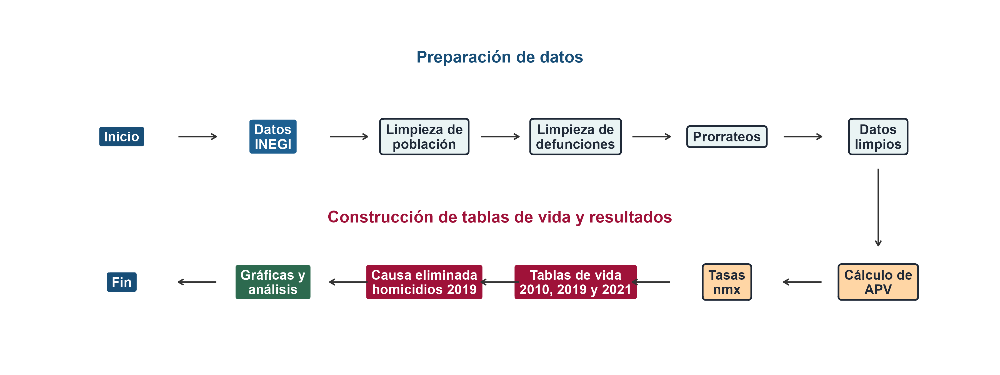
```

El segundo proceso corresponde al cálculo de los indicadores de fecundidad y reproducción. Este flujo parte de los nacimientos registrados y de la población femenina en edades reproductivas, para estimar las TEFE, TGF, TBR y TNR.

```{r}
#| echo: false
#| message: false
#| warning: false
#| fig-align: center
#| out-width: "100%"

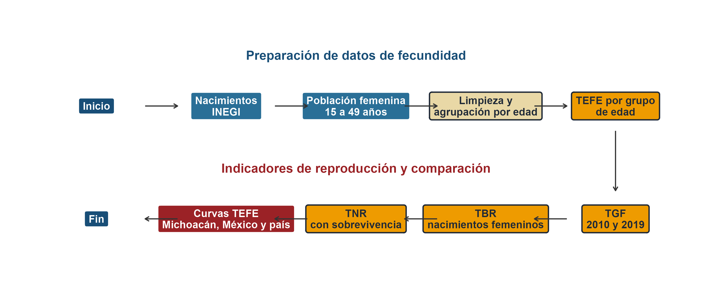
```

Ambos diagramas resumen las etapas necesarias para que el procedimiento sea replicable: preparación de datos, cálculo de indicadores, generación de resultados y análisis final.

## c) Fórmulas utilizadas

Para el informe final se utilizaron fórmulas correspondientes a tres partes del proyecto: tablas de vida, tabla de vida de causa eliminada por homicidios e indicadores de fecundidad. Las expresiones se aplicaron por sexo, año y grupo de edad cuando fue necesario.

### Crecimiento exponencial para estimar APV

Como solo se cuenta con población censal para 2010 y 2020, la población expuesta al riesgo se estimó mediante crecimiento exponencial. Para cada grupo de edad y sexo se utilizó:

$$
N(t)=N_0e^{r(t-t_0)}
$$

donde (N(t)) es la población estimada en el tiempo (t), (N_0) es la población inicial, (t_0) es el año inicial y (r) es la tasa de crecimiento intercensal. La tasa (r) se calculó como:

$$
r=\frac{\ln(N_T/N_0)}{t_T-t_0}
$$

donde (N_T) es la población observada al final del periodo y (t_T) el año final. Con esta fórmula se estimaron los APV para 2010, 2019 y 2021.

### Tasa central de mortalidad

La tasa central de mortalidad se calculó como el cociente entre las defunciones y la población expuesta al riesgo:

$$
{}_nm_x=\frac{{}_nD_x}{{}_nAPV_x}
$$

donde ({}\_nD_x) representa las defunciones ocurridas entre las edades (x) y (x+n), y ({}\_nAPV_x) representa la población expuesta al riesgo en ese mismo intervalo.

Para reducir fluctuaciones anuales, las defunciones de los años de referencia se trabajaron como promedios:

$$
D_x^{ref}=\frac{1}{k}\sum_{j=1}^{k}D_{x,j}
$$

En particular:

$$
D_x^{2010}=\frac{D_x^{2009}+D_x^{2010}+D_x^{2011}}{3}
$$

$$
D_x^{2019}=\frac{D_x^{2018}+D_x^{2019}}{2}
$$

$$
D_x^{2021}=\frac{D_x^{2020}+D_x^{2021}+D_x^{2022}}{3}
$$

### Promedio de años vividos por quienes fallecen

El término ({}\_na_x) representa el promedio de años vividos dentro del intervalo por quienes fallecieron entre las edades (x) y (x+n). Para los grupos de edad de 5 años en adelante se utilizó:

$$
{}_na_x=\frac{n}{2}
$$

Para la edad 0 y el grupo 1 a 4 años se utilizaron las expresiones de Coale-Demeny vistas en clase, diferenciadas por sexo.

### Probabilidad de muerte y sobrevivencia

La probabilidad de morir entre las edades (x) y (x+n) se obtuvo con:

$$
{}_nq_x=
\frac{n\cdot {}_nm_x}
{1+(n-{}_na_x)\cdot {}_nm_x}
$$

Para el grupo abierto final se asumió:

$$
{}_{\omega}q_x=1
$$

La probabilidad de sobrevivir en el intervalo fue:

$$
{}_np_x=1-{}_nq_x
$$

### Sobrevivientes y defunciones de la cohorte

Se tomó una raíz de la tabla de vida de:

$$
l_0=100000
$$

A partir de esta raíz, los sobrevivientes se calcularon de manera recursiva:

$$
l_{x+n}=l_x\cdot {}_np_x
$$

Las defunciones de la cohorte hipotética fueron:

$$
{}_nd_x=l_x\cdot {}_nq_x
$$

De manera equivalente:

$$
{}*nd_x=l_x-l*{x+n}
$$

### Años persona y esperanza de vida

Los años persona vividos entre las edades (x) y (x+n) se calcularon como:

$$
{}*nL_x=n\cdot l*{x+n}+{}_na_x\cdot {}_nd_x
$$

Para el grupo abierto final se utilizó:

$$
{}*{\omega}L_x=\frac{l_x}{{}*{\omega}m_x}
$$

El total de años persona por vivir a partir de la edad (x) se obtuvo acumulando desde la última edad hacia atrás:

$$
T_x=\sum_{y=x}^{\omega}{}_nL_y
$$

La esperanza de vida a la edad exacta (x) se calculó como:

$$
e_x^0=\frac{T_x}{l_x}
$$

En particular, la esperanza de vida al nacer fue:

$$
e_0^0=\frac{T_0}{l_0}
$$

### Tabla de vida de causa eliminada: homicidios

Para construir la tabla de vida de 2019 con causa eliminada, se separaron las defunciones totales de las defunciones por homicidio. Si (i) representa la causa homicidios, entonces ({}\_nD_x) son las defunciones totales y ({}\_nD_x\^i) las defunciones por homicidio.

Primero se calculó la proporción de defunciones que no corresponden a la causa (i):

$$
R^{-i}=\frac{{}_nD_x-{}_nD_x^i}{{}_nD_x}
$$

De manera equivalente:

$$
R^{-i}=1-\frac{{}_nD_x^i}{{}_nD_x}
$$

Con esta proporción se ajustó la probabilidad de sobrevivencia original:

$$
{}_np_x^{-i}=({}_np_x)^{R^{-i}}
$$

y la probabilidad de muerte sin la causa (i) fue:

$$
{}_nq_x^{-i}=1-{}_np_x^{-i}
$$

Con ({}\_nq_x\^{-i}) se reconstruyó la tabla de vida de 2019 sin homicidios, usando las mismas funciones de la tabla de vida:

$$
l_{x+n}^{-i}=l_x^{-i}\cdot {}_np_x^{-i}
$$

$$
{}_nd_x^{-i}=l_x^{-i}\cdot {}_nq_x^{-i}
$$

$$
{}*nL_x^{-i}=n\cdot l*{x+n}^{-i}+{}_na_x^{-i}\cdot {}_nd_x^{-i}
$$

$$
T_x^{-i}=\sum_{y=x}^{\omega}{}_nL_y^{-i}
$$

$$
e_x^{-i}=\frac{T_x^{-i}}{l_x^{-i}}
$$

La ganancia en esperanza de vida por eliminar homicidios se calculó como:

$$
\Delta e_0=e_0^{-i}-e_0
$$

### Tasa Específica de Fecundidad por Edad

La Tasa Específica de Fecundidad por Edad mide los nacimientos ocurridos en un grupo de edad de la madre respecto a la población femenina expuesta en ese mismo grupo:

$$
{}_5f_x=\frac{{}_5B_x}{{}_5P_x^F}
$$

donde ({}\_5B_x) son los nacimientos de madres entre las edades (x) y (x+5), y ({}\_5P_x\^F) es la población femenina en ese grupo de edad.

Si la tasa se expresa por cada mil mujeres:

$$
{}_5f_x^{(1000)}=\frac{{}_5B_x}{{}_5P_x^F}\cdot 1000
$$

Para calcular los indicadores sintéticos se utilizó la tasa en forma decimal:

$$
{}_5f_x=\frac{{}_5f_x^{(1000)}}{1000}
$$

### Tasa Global de Fecundidad

La Tasa Global de Fecundidad resume el número promedio de hijos que tendría una cohorte hipotética de mujeres expuesta a las tasas específicas de fecundidad del año analizado. Como las tasas están agrupadas en intervalos quinquenales, se calculó como:

$$
TGF=5\sum_{x=15}^{45}{}_5f_x
$$

es decir:

$$
TGF=5({}*5f*{15}+{}*5f*{20}+{}*5f*{25}+{}*5f*{30}+{}*5f*{35}+{}*5f*{40}+{}*5f*{45})
$$

### Tasa Bruta de Reproducción

La Tasa Bruta de Reproducción mide el número promedio de hijas que tendría una mujer, suponiendo ausencia de mortalidad femenina. Se calculó como:

$$
TBR=K\cdot TGF
$$

donde (K) es la proporción de nacimientos femeninos. Bajo el supuesto de 105 nacimientos masculinos por cada 100 femeninos:

$$
K=\frac{100}{205}=0.4878
$$

### Tasa Neta de Reproducción

La Tasa Neta de Reproducción incorpora la mortalidad femenina durante las edades reproductivas. Se calculó con la tabla de vida femenina:

$$
TNR=
5K\sum_{x=15}^{45}{}_5f_x\cdot
\frac{{}_5L_x^F}{5l_0}
$$

donde ({}\_5L_x\^F) representa los años persona vividos por la cohorte femenina entre las edades (x) y (x+5), y (l_0) es la raíz de la tabla de vida.

### Nivel de reemplazo

El nivel de reemplazo se alcanza cuando cada mujer, en promedio, es reemplazada por una hija sobreviviente. Por ello, la condición de reemplazo se expresa como:

$$
TNR=1
$$

Si no existiera mortalidad femenina, la condición aproximada sería:

$$
TBR=1
$$

Como:

$$
TBR=K\cdot TGF
$$

entonces:

$$
TGF=\frac{1}{K}
$$

Usando (K=0.4878):

$$
TGF=\frac{1}{0.4878}\approx 2.05
$$

Al incorporar mortalidad femenina antes y durante las edades reproductivas, el nivel de reemplazo aumenta ligeramente. Por esta razón, en la práctica demográfica se aproxima a:

$$
TGF\approx 2.1
$$

### Demostración de la tasa de reemplazo

La tasa de reemplazo se entiende como el nivel de fecundidad necesario para que, en promedio, una generación de mujeres sea reemplazada por otra generación de mujeres. En términos demográficos, la condición de reemplazo se expresa mediante la Tasa Neta de Reproducción:

$$
TNR = 1
$$

La Tasa Neta de Reproducción mide el número promedio de hijas que tendría una mujer, considerando tanto la fecundidad como la sobrevivencia femenina hasta las edades reproductivas. De forma general:

$$
TNR = p(A)\cdot TBR
$$

donde $p(A)$ representa la probabilidad promedio de sobrevivir hasta las edades reproductivas y $TBR$ es la Tasa Bruta de Reproducción. Por lo tanto:

$$
TBR=\frac{TNR}{p(A)}
$$

Como en reemplazo se requiere que:

$$
TNR=1
$$

entonces:

$$
TBR=\frac{1}{p(A)}
$$

Ahora bien, la Tasa Bruta de Reproducción considera únicamente los nacimientos femeninos. Por eso se relaciona con la Tasa Global de Fecundidad mediante la proporción de nacimientos femeninos:

$$
TBR = K\cdot TGF
$$

donde $K$ es la proporción de nacimientos femeninos. Usualmente se supone una razón de sexos al nacimiento de 105 hombres por cada 100 mujeres, por lo que:

$$
K=\frac{100}{205}=0.4878
$$

Despejando la Tasa Global de Fecundidad:

$$
TGF=\frac{TBR}{K}
$$

Sustituyendo $TBR=\frac{1}{p(A)}$:

$$
TGF=\frac{1}{p(A)\cdot K}
$$

Si se toma una sobrevivencia femenina aproximada hasta edades reproductivas de:

$$
p(A)\approx 0.98
$$

entonces:

$$
TGF=\frac{1}{0.98(0.4878)}
$$

$$
TGF\approx 2.09
$$

Por lo tanto, se aproxima a:

$$
TGF\approx 2.1
$$

Esto significa que, para que una población se reemplace en el largo plazo, no basta con que cada mujer tenga exactamente dos hijos. Se necesita un poco más de dos, porque no todos los nacimientos son mujeres y porque no todas las mujeres sobreviven hasta completar las edades reproductivas. Por esa razón, la tasa de reemplazo se expresa comúnmente como aproximadamente 2.1 hijos por mujer.


## d) Código utilizado para los cálculos

El código del proyecto se organizó en scripts separados para que el procedimiento fuera más claro y replicable. Todos los archivos se encuentran en la carpeta `script/` del repositorio. El informe se genera a partir del archivo Quarto y ejecuta los scripts en el siguiente orden:

```{r}
#| eval: false

source("script/00_config.R")
source("script/01_poblacion.R")
source("script/02_defunciones.R")
source("script/03_apv.R")
source("script/04_tablas_vida.R")
source("script/05_graficas.R")
source("script/06_exportar_tablas_vida.R")
source("script/07_tablas_vida_visuales.R")
```

El archivo `00_config.R` define las rutas, los años de análisis, la entidad federativa y los paquetes necesarios. También permite que el proyecto sea replicable desde una misma estructura de carpetas.

```{r}
#| eval: false

ruta_data <- "data/"
ruta_scripts <- "script/"
ruta_graficos <- "output/"

entidad_objetivo <- "Michoacán de Ocampo"

anios_objetivo <- c(2010, 2019, 2021)

anios_defunciones <- c(2009, 2010, 2011,
                       2018, 2019,
                       2020, 2021, 2022)

l0 <- 100000
```

El archivo `01_poblacion.R` limpia la población censal de 2010 y 2020, agrupa las edades en intervalos compatibles con una tabla de vida abreviada y prorratea la población con edad no especificada.

```{r}
#| eval: false

poblacion_2010 <- leer_poblacion(archivo_poblacion_2010, 2010)
poblacion_2020 <- leer_poblacion(archivo_poblacion_2020, 2020)

poblacion <- rbind(poblacion_2010, poblacion_2020)
```

El archivo `02_defunciones.R` limpia las defunciones registradas, trabaja con el año de ocurrencia, agrupa por edad y sexo, prorratea el sexo no especificado y construye los años de referencia del proyecto.

```{r}
#| eval: false

def_long[, anio := case_when(
  anio_ocurrencia %in% c(2009, 2010, 2011) ~ 2010,
  anio_ocurrencia %in% c(2018, 2019) ~ 2019,
  anio_ocurrencia %in% c(2020, 2021, 2022) ~ 2021,
  TRUE ~ NA_real_
)]

defunciones <- def_long[
  !is.na(anio),
  .(defunciones = mean(defunciones, na.rm = TRUE)),
  by = .(anio, sexo, edad)
]
```

El archivo `03_apv.R` estima los años persona vividos mediante crecimiento exponencial entre la población censal de 2010 y 2020.

```{r}
#| eval: false

expo <- function(N0, NT, t0, tT, t) {
  t0_dec <- fecha_decimal(t0)
  tT_dec <- fecha_decimal(tT)
  
  r <- log(NT / N0) / (tT_dec - t0_dec)
  h <- t - t0_dec
  
  Nt <- N0 * exp(r * h)
  
  return(Nt)
}
```

El archivo `04_tablas_vida.R` une defunciones y APV, calcula las tasas centrales de mortalidad y construye las seis tablas de vida.

```{r}
#| eval: false

base_tabla <- merge(
  apv,
  defunciones,
  by = c("anio", "sexo", "edad"),
  all.x = TRUE
)

base_tabla[, mx := defunciones / APV]
```

La función principal de este script calcula las funciones de la tabla de vida: (nmx), (nax), (nqx), (npx), (lx), (ndx), (nLx), (Tx) y (ex).

```{r}
#| eval: false

qx <- (n * mx) / (1 + (n - ax) * mx)
qx[length(qx)] <- 1

px <- 1 - qx

lx <- numeric(length(x))
lx[1] <- l0

for (i in 2:length(lx)) {
  lx[i] <- lx[i - 1] * px[i - 1]
}

dx <- lx * qx
```

Finalmente, los scripts `05_graficas.R`, `06_exportar_tablas_vida.R` y `07_tablas_vida_visuales.R` generan las gráficas del informe, exportan las seis tablas finales en CSV y producen versiones visuales en imagen para facilitar la revisión rápida de resultados.

## e) Esperanza de vida al nacer por sexo y año

La esperanza de vida al nacer resume el nivel general de mortalidad de cada año y sexo. En este proyecto se obtiene a partir de las tablas de vida construidas para Michoacán, tomando el valor de $e_0^0$, es decir, la esperanza de vida a la edad exacta cero.

```{r}
#| echo: false
#| message: false
#| warning: false
#| fig-align: center
#| out-width: "75%"

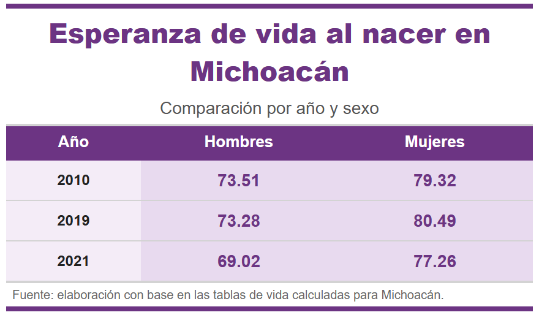
```

El cuadro permite comparar la evolución de la esperanza de vida entre 2010, 2019 y 2021. En particular, 2019 funciona como referencia previa a la pandemia, mientras que 2021 permite observar el deterioro asociado al aumento de la mortalidad durante la COVID-19.

Además, para 2019 se comparó la esperanza de vida observada contra la esperanza de vida estimada al eliminar las defunciones por homicidio. Esta comparación permite medir el efecto de dicha causa de muerte sobre el nivel general de mortalidad de la entidad.

```{r}
#| echo: false
#| message: false
#| warning: false
#| fig-align: center
#| out-width: "80%"

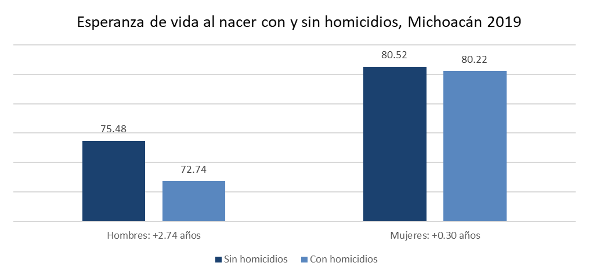
```

La gráfica muestra que la eliminación de homicidios aumenta la esperanza de vida al nacer, especialmente en hombres. Esto indica que los homicidios tienen un peso más importante dentro de la mortalidad masculina de Michoacán en 2019, mientras que el efecto en mujeres es menor.

## f) Gráficas del informe

A continuación se presentan las principales gráficas derivadas de las tablas de vida. Se muestran las tasas centrales de mortalidad ${}_n m_x$, las probabilidades de muerte ${}_n q_x$, la función de sobrevivientes $l_x$, la evolución de la esperanza de vida al nacer y la comparación de probabilidades de muerte con y sin homicidios para 2019.

```{r}
#| echo: false
#| message: false
#| warning: false
#| fig-align: center
#| out-width: "92%"

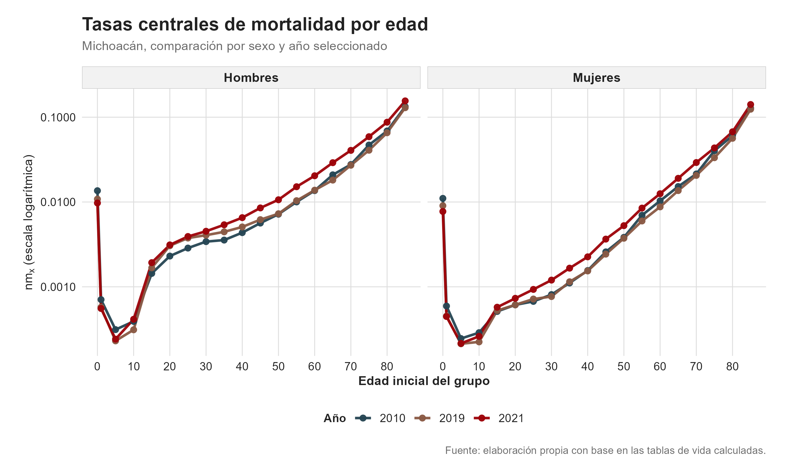
```

La gráfica de ${}_n m_x$ muestra las tasas centrales de mortalidad por edad, sexo y año. Esta función permite observar cómo cambia la intensidad de la mortalidad a lo largo del ciclo de vida. En general, las tasas son menores en edades jóvenes y aumentan conforme avanza la edad.

```{r}
#| echo: false
#| message: false
#| warning: false
#| fig-align: center
#| out-width: "92%"

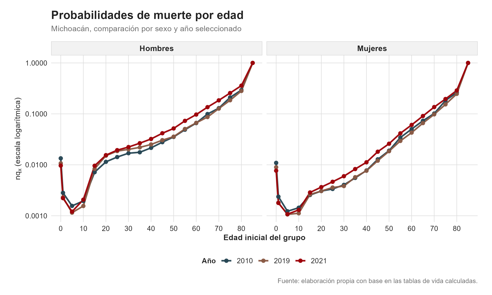
```

La gráfica de ${}_n q_x$ presenta las probabilidades de muerte por edad, sexo y año. Esta medida permite comparar directamente el riesgo de fallecer dentro de cada intervalo de edad. Al igual que con las tasas centrales de mortalidad, se observa un incremento importante en las edades avanzadas.

```{r}
#| echo: false
#| message: false
#| warning: false
#| fig-align: center
#| out-width: "92%"

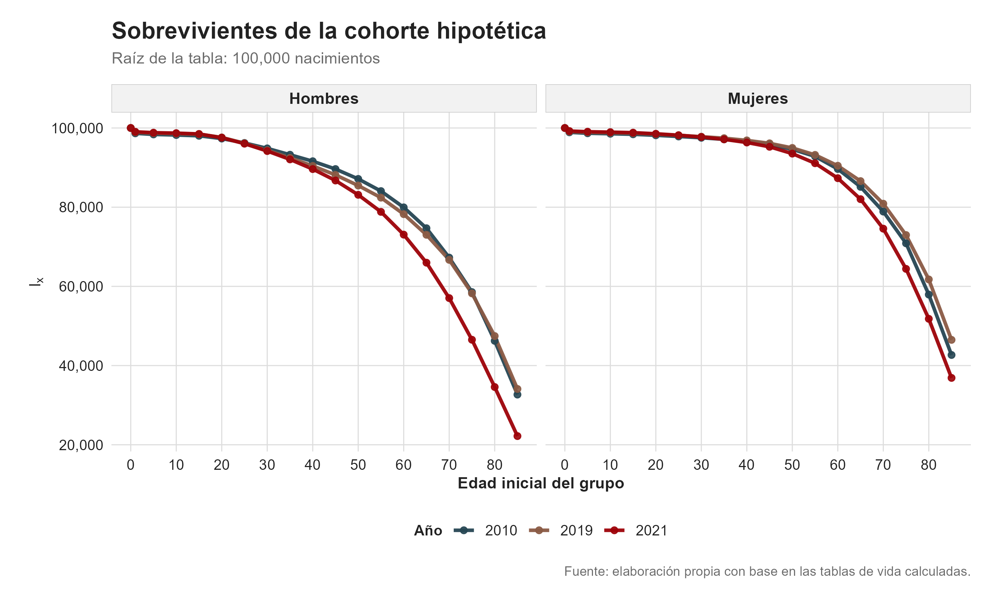
```

La curva $l_x$ representa el número de sobrevivientes de una cohorte hipotética de 100,000 nacimientos. Su descenso muestra cómo se va reduciendo la cohorte conforme avanza la edad. Esta función permite visualizar de forma más directa el efecto acumulado de la mortalidad.

```{r}
#| echo: false
#| message: false
#| warning: false
#| fig-align: center
#| out-width: "85%"

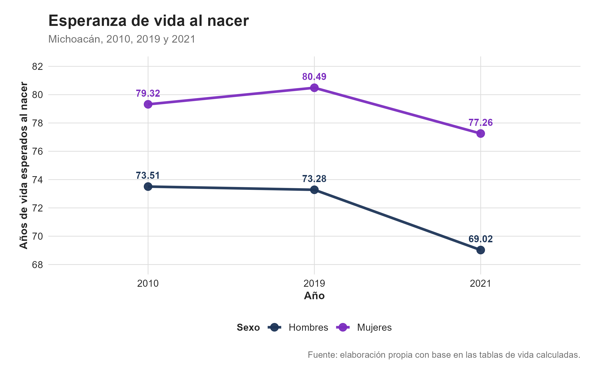
```

La gráfica de esperanza de vida al nacer resume los cambios en el nivel general de mortalidad. Esta comparación permite observar las diferencias entre hombres y mujeres, así como el cambio entre 2010, 2019 y 2021. En particular, el año 2021 muestra una reducción importante, asociada al aumento de la mortalidad durante el periodo de pandemia.

```{r}
#| echo: false
#| message: false
#| warning: false
#| fig-align: center
#| out-width: "95%"

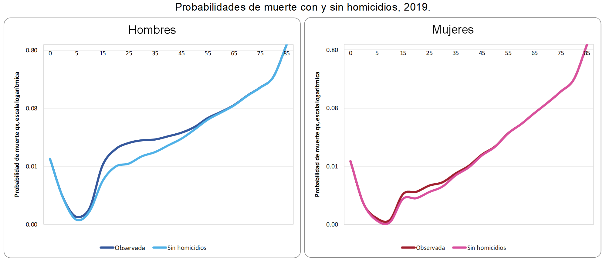
```

La gráfica anterior compara las probabilidades de muerte observadas en 2019 con las probabilidades estimadas al eliminar las defunciones por homicidio. El efecto es más visible en hombres, principalmente en edades jóvenes y adultas, donde los homicidios representan una proporción mayor de las defunciones. En mujeres, las curvas son más cercanas, lo que indica un impacto menor de esta causa sobre la mortalidad general.

### Tablas de vida de 2019 y causa eliminada por homicidios

Además de las gráficas anteriores, se incluyen las tablas de vida correspondientes a 2019 para hombres y mujeres. Se eligió este año porque funciona como referencia previa a la pandemia y permite compararlo directamente con las tablas de vida de causa eliminada por homicidios. Estas tablas muestran los componentes principales: ${}_n m_x$, ${}_n q_x$, $l_x$, ${}_n d_x$, ${}_n L_x$, $T_x$ y $e_x$.

```{r}
#| echo: false
#| message: false
#| warning: false
#| fig-align: center
#| out-width: "100%"

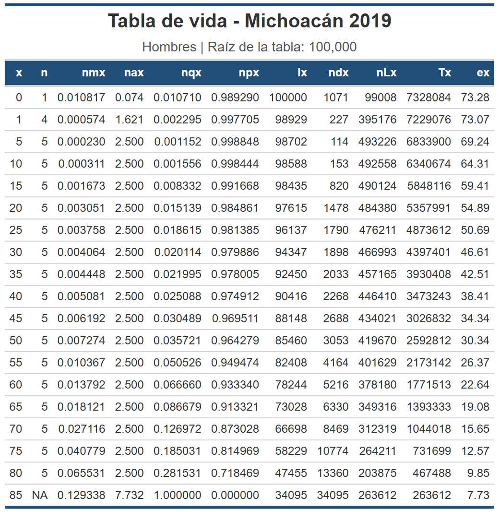
```

La tabla anterior muestra la tabla de vida observada para hombres en 2019. Esta tabla sirve como base para comparar el efecto de eliminar las defunciones por homicidio.

```{r}
#| echo: false
#| message: false
#| warning: false
#| fig-align: center
#| out-width: "100%"

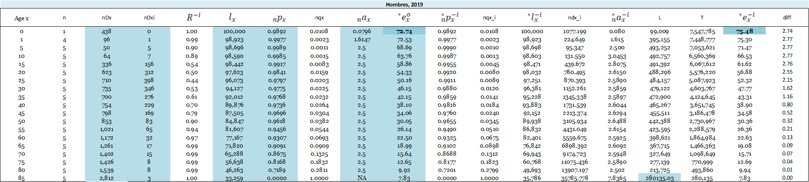
```

La tabla anterior presenta la tabla de vida masculina de 2019 con causa eliminada por homicidios. Al compararla con la tabla observada, se puede revisar cómo cambian las probabilidades de muerte y la esperanza de vida cuando se excluye esta causa.

```{r}
#| echo: false
#| message: false
#| warning: false
#| fig-align: center
#| out-width: "100%"

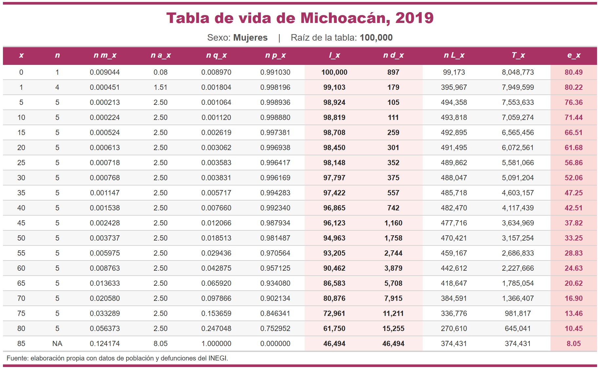
```

La tabla anterior muestra la tabla de vida observada para mujeres en 2019. Su inclusión permite comparar el comportamiento de la mortalidad femenina con el caso masculino en el mismo año.

```{r}
#| echo: false
#| message: false
#| warning: false
#| fig-align: center
#| out-width: "100%"

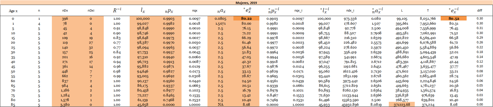
```

La tabla anterior presenta la tabla de vida femenina de 2019 con causa eliminada por homicidios. En este caso, el cambio respecto a la tabla observada es menor que en hombres, lo cual es consistente con la menor participación de los homicidios dentro de la mortalidad femenina.

## g) Análisis de resultados

A partir de las tablas de vida construidas para Michoacán en 2010, 2019 y 2021, se observa que la mortalidad presenta diferencias importantes por edad, sexo y año. En general, las funciones ({}_n m_x) y ({}_n q_x) muestran el comportamiento esperado: niveles relativamente altos en las primeras edades, una disminución durante la niñez y un aumento progresivo conforme avanza la edad. Este patrón indica que la mortalidad no se distribuye de manera uniforme, sino que se concentra con mayor intensidad en las edades adultas y, sobre todo, en las edades avanzadas.

Para resumir el cambio general en la mortalidad, se utiliza la esperanza de vida al nacer. Este indicador permite comparar de forma directa el nivel de mortalidad entre años y entre sexos, ya que concentra en un solo valor el efecto de las tasas de mortalidad observadas en todas las edades.

```{r}
#| echo: false
#| message: false
#| warning: false
#| fig-align: center
#| out-width: "85%"

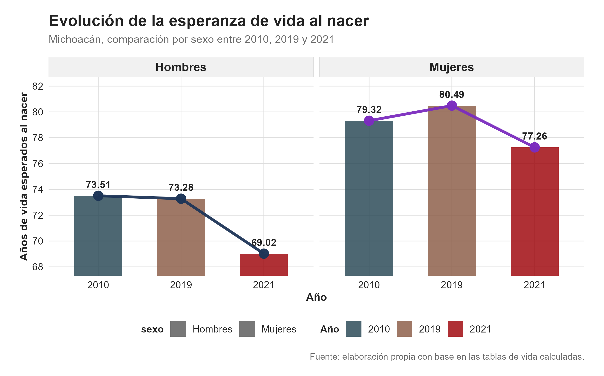
```

Entre 2010 y 2019, el comportamiento previo a la pandemia no fue igual para hombres y mujeres. En hombres, la esperanza de vida al nacer se mantuvo prácticamente estable, lo que sugiere que antes de la pandemia no hubo una mejora clara en el nivel general de mortalidad masculina. En cambio, en mujeres sí se observa una mejora, manteniendo una ventaja importante en supervivencia respecto a los hombres.

El cambio más fuerte aparece en 2021. En hombres, la esperanza de vida al nacer cae de manera importante respecto a 2019, y en mujeres también se observa una reducción clara. Por lo tanto, aunque ambos sexos fueron afectados por el aumento de la mortalidad durante la pandemia, el deterioro fue más fuerte en hombres.

Este resultado es importante porque muestra que el impacto de la COVID-19 no solo se reflejó en un aumento de defunciones, sino también en una pérdida clara de años de esperanza de vida. En términos de las tablas de vida, esto significa que las probabilidades de muerte aumentaron lo suficiente como para reducir el número esperado de años por vivir desde el nacimiento. La reducción observada en 2021 es consistente con el efecto de la pandemia, especialmente porque el riesgo de muerte fue mayor en edades adultas y avanzadas.

Además del análisis por año, se construyó una tabla de vida de 2019 con causa eliminada por homicidios. Este ejercicio permite observar cuánto cambiaría la esperanza de vida si se eliminaran las defunciones asociadas a esta causa. La comparación muestra que el efecto es mucho mayor en hombres: la esperanza de vida al nacer pasa de 72.74 años observados a 75.48 años sin homicidios, con una ganancia aproximada de 2.74 años. En mujeres, el cambio es menor, al pasar de 80.30 a 80.60 años, con una ganancia cercana a 0.30 años.

```{r}
#| echo: false
#| message: false
#| warning: false
#| fig-align: center
#| out-width: "85%"


```

Las probabilidades de muerte con y sin homicidios refuerzan esta interpretación. En hombres, la diferencia entre las curvas se concentra principalmente en edades jóvenes y adultas, donde los homicidios tienen mayor peso relativo dentro de las defunciones. En mujeres, las curvas se mantienen mucho más cercanas, lo que indica que esta causa tiene un impacto menor sobre su mortalidad general.

Al analizar las diferencias por sexo, se mantiene la ventaja femenina en los años estudiados. Las mujeres presentan mayor esperanza de vida que los hombres tanto antes como durante la pandemia. Esta diferencia puede relacionarse con factores biológicos, sociales y de exposición a riesgos externos. En el caso de Michoacán, también deben considerarse elementos propios de la entidad, como la desigualdad territorial, la presencia de zonas rurales, diferencias en el acceso a servicios de salud, procesos migratorios y condiciones de violencia que pueden afectar con mayor fuerza a la población masculina joven y adulta.

Las curvas de (l_x) permiten interpretar el efecto acumulado de la mortalidad. Al partir de una cohorte hipotética de 100,000 nacimientos, la función (l_x) muestra cuántas personas sobreviven a cada edad. Cuando la mortalidad aumenta, la cohorte se reduce con mayor rapidez. Por ello, al comparar 2019 con 2021, el descenso más marcado de la supervivencia refleja condiciones de mortalidad más desfavorables durante el año afectado por la pandemia.

En conjunto, los resultados muestran cuatro aspectos centrales para Michoacán. Primero, antes de la pandemia la evolución fue desigual por sexo: las mujeres mejoraron su esperanza de vida, mientras que los hombres permanecieron casi sin avance. Segundo, la pandemia produjo una caída clara de la esperanza de vida en 2021, con un efecto más fuerte en hombres. Tercero, las diferencias entre hombres y mujeres se mantuvieron durante todo el periodo. Cuarto, la tabla de causa eliminada muestra que los homicidios tienen un efecto importante sobre la esperanza de vida masculina en 2019. Así, las tablas de vida permiten observar de manera ordenada cómo cambió la mortalidad general y cómo ciertas causas específicas afectan de forma diferenciada a la población.

