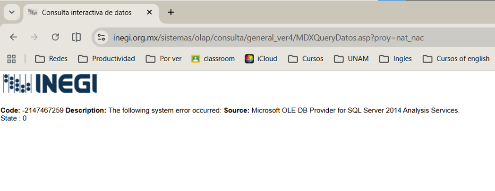

# 🦋 Proyecto final 9219: Michoacán, una exploración demográfica

------------------------------------------------------------------------

## 🌎 Descripción general

Este repositorio contiene el proyecto final del curso de **Demografía 9219**, enfocado en el análisis demográfico de **Michoacán de Ocampo**.

El trabajo incluye la construcción de tablas de vida abreviadas para los años **2010, 2019 y 2021**, separadas por sexo. Además, se incorpora una tabla de vida de **2019 con causa eliminada por homicidios**, junto con gráficas y análisis para comparar la mortalidad observada contra la mortalidad estimada sin esa causa.

El informe también integra el apartado de fecundidad solicitado en la segunda parte del proyecto: demostración de la tasa de reemplazo, indicadores de fecundidad y comparación de curvas TEFE.

------------------------------------------------------------------------

## 👥 Integrantes

-   Salvador Halave Cubillo
-   Angel Gabriel Camacho Cruz

------------------------------------------------------------------------

## 🎯 ¿Qué contiene el proyecto?

El proyecto está organizado para revisar tres partes principales:

### 1. Mortalidad general

Se construyeron tablas de vida para Michoacán en:

``` text
2010 - Hombres
2010 - Mujeres
2019 - Hombres
2019 - Mujeres
2021 - Hombres
2021 - Mujeres
```

A partir de ellas se analizaron las tasas de mortalidad, probabilidades de muerte, sobrevivientes y esperanza de vida al nacer.

### 2. Causa eliminada por homicidios

Para 2019 se construyeron tablas de vida comparando:

``` text
2019 observado
2019 sin homicidios
```

Esto permite estimar cuánto cambiaría la esperanza de vida al nacer si se eliminaran las defunciones por homicidio.

### 3. Fecundidad y reemplazo (Pendiente, la pagina de INEGI no me arroja los datos)



El informe va a incluir la documentación de la tasa de reemplazo y el planteamiento de los indicadores de fecundidad solicitados:

``` text
TEFE
TGF
TBR
TNR
```

------------------------------------------------------------------------

## 📊 Resultados principales de mortalidad

La esperanza de vida al nacer estimada en las tablas de vida generales fue:

| Año  | Hombres | Mujeres |
|------|---------|---------|
| 2010 | 73.51   | 79.32   |
| 2019 | 73.28   | 80.49   |
| 2021 | 69.02   | 77.26   |

Estos resultados muestran una caída importante en 2021, especialmente en hombres, lo cual es consistente con el aumento de la mortalidad durante el periodo de pandemia.

En la tabla de causa eliminada por homicidios para 2019, la esperanza de vida al nacer se comparó así:

| Escenario      | Hombres | Mujeres |
|----------------|---------|---------|
| Con homicidios | 72.74   | 80.30   |
| Sin homicidios | 75.48   | 80.60   |
| Diferencia     | 2.74    | 0.30    |

El efecto de eliminar homicidios es mayor en hombres, principalmente por el peso de esta causa en edades jóvenes y adultas.

------------------------------------------------------------------------

## 📁 Estructura del repositorio

``` text
Repositorio/
├── README.md
└── Proyecto_Final_Michoacan/
    ├── data/
    │   ├── Graficos/
    │   ├── defunciones_inegi.xlsx
    │   ├── poblacion_2010.xlsx
    │   └── poblacion_2020.xlsx
    │   
    │
    ├── output/
    │   ├── CausaEliminadaMichVersionFinal.xlsx
    │   ├── TasasDeMortalidadVersionFinal.xlsx
    │   ├── CausaEliminada_nqx.png
    │   ├── CausaEliminadaHomb2019.png
    │   ├── CausaEliminadaMujer2019.png
    │   ├── EspVidaCauElimMich.png
    │   ├── diagrama_fecundidad.png
    │   ├── diagrama_flujo.png
    │   ├── mx_michoacan_formal.png
    │   ├── qx_michoacan_formal.png
    │   ├── lx_michoacan_formal.png
    │   └── esperanza_vida_michoacan_formal.png
    │
    ├── resultados_tablas_vida/
    │   ├── csv/
    │   └── png/
    │
    ├── script/
    │   ├── 00_config.R
    │   ├── 01_poblacion.R
    │   ├── 02_defunciones.R
    │   ├── 03_apv.R
    │   ├── 04_tablas_vida.R
    │   ├── 05_graficas.R
    │   ├── 06_exportar_tablas_vida.R
    │   ├── 07_tablas_vida_visuales.R
    │   ├── 08_diagrama_flujo.R
    │   └── 09_diagrama_fecundidad.R
    │
    ├── Proyecto_Final_Demografia.qmd
    ├── Proyecto_Final_Demografia.pdf
    └── Proyecto_Final_Michoacan.Rproj
```

------------------------------------------------------------------------

## 🧭 Guía rápida para revisar la entrega

Esta sección indica dónde encontrar cada elemento solicitado.

| Elemento solicitado | Ubicación |
|----|----|
| Informe final en PDF | `Proyecto_Final_Michoacan/Proyecto_Final_Demografia.pdf` |
| Archivo editable del informe | `Proyecto_Final_Michoacan/Proyecto_Final_Demografia.qmd` |
| Excel final de tasas de mortalidad | `Proyecto_Final_Michoacan/output/TasasDeMortalidadVersionFinal.xlsx` |
| Excel de causa eliminada por homicidios | `Proyecto_Final_Michoacan/output/CausaEliminadaMichVersionFinal.xlsx` |
| Datos originales de población y defunciones | `Proyecto_Final_Michoacan/data/` |
| Código utilizado para los cálculos | `Proyecto_Final_Michoacan/script/` |
| Diagramas de flujo | `Proyecto_Final_Michoacan/output/diagrama_flujo.png` y `Proyecto_Final_Michoacan/output/diagrama_fecundidad.png` |
| Gráficas finales | `Proyecto_Final_Michoacan/output/` |
| Tablas de vida en CSV | `Proyecto_Final_Michoacan/resultados_tablas_vida/csv/` |
| Tablas de vida en imagen | `Proyecto_Final_Michoacan/resultados_tablas_vida/png/` |
| Tablas de causa eliminada en imagen | `Proyecto_Final_Michoacan/output/CausaEliminadaHomb2019.png` y `Proyecto_Final_Michoacan/output/CausaEliminadaMujer2019.png` |
| Gráfica de esperanza de vida con causa eliminada | `Proyecto_Final_Michoacan/output/EspVidaCauElimMich.png` |
| Gráfica de (q_x) con causa eliminada | `Proyecto_Final_Michoacan/output/CausaEliminada_nqx.png` |

------------------------------------------------------------------------

## 📂 Carpetas principales

### `Proyecto_Final_Michoacan/data/`

Contiene las bases utilizadas para el proyecto:

-   población censal de 2010;
-   población censal de 2020;
-   defunciones registradas;
-   archivo inicial de tasas de mortalidad;
-   recursos gráficos auxiliares.

### `Proyecto_Final_Michoacan/script/`

Contiene los códigos en R organizados por etapa. Estos scripts permiten limpiar datos, estimar APV, construir tablas de vida, generar gráficas y crear diagramas.

### `Proyecto_Final_Michoacan/output/`

Contiene los archivos finales que se usan directamente en el informe:

-   gráficas;
-   diagramas;
-   Excel de tasas de mortalidad;
-   Excel de causa eliminada;
-   tablas visuales de causa eliminada.

### `Proyecto_Final_Michoacan/resultados_tablas_vida/`

Contiene las tablas de vida generales en dos formatos:

-   `csv/`: tablas numéricas;
-   `png/`: tablas visuales para el informe.

------------------------------------------------------------------------

## 🧾 Informe final

El informe final se encuentra en:

``` text
Proyecto_Final_Michoacan/Proyecto_Final_Demografia.pdf
```

El archivo fuente editable está en:

``` text
Proyecto_Final_Michoacan/Proyecto_Final_Demografia.qmd
```

El documento incluye:

-   contexto demográfico de Michoacán;
-   diagramas de flujo;
-   fórmulas utilizadas;
-   código principal;
-   tablas de vida;
-   cuadro de esperanza de vida al nacer;
-   gráficas de mortalidad;
-   causa eliminada por homicidios;
-   demostración de la tasa de reemplazo;
-   análisis de resultados.

------------------------------------------------------------------------

## 📌 Fuentes de información

Los datos utilizados provienen de **INEGI**.

Se emplearon principalmente:

-   Censo de Población y Vivienda 2010;
-   Censo de Población y Vivienda 2020;
-   Estadísticas de Defunciones Registradas;
-   información de homicidios por edad, sexo y año de ocurrencia.

Las defunciones se trabajaron considerando edad, sexo, año de ocurrencia y entidad correspondiente.

------------------------------------------------------------------------

## 🛠️ Herramientas utilizadas

El proyecto se trabajó con:

-   R;
-   RStudio;
-   Quarto;
-   Excel;
-   datos de INEGI.

Paquetes principales usados en R:

``` r
data.table
dplyr
tidyr
ggplot2
readxl
stringr
knitr
gt
webshot2
```

------------------------------------------------------------------------

## ▶️ Cómo reproducir el proyecto

Para reproducir la parte programada del proyecto, abrir el archivo:

``` text
Proyecto_Final_Michoacan/Proyecto_Final_Michoacan.Rproj
```

en RStudio y ejecutar los scripts en este orden:

``` r
source("script/00_config.R")
source("script/01_poblacion.R")
source("script/02_defunciones.R")
source("script/03_apv.R")
source("script/04_tablas_vida.R")
source("script/05_graficas.R")
source("script/06_exportar_tablas_vida.R")
source("script/07_tablas_vida_visuales.R")
source("script/08_diagrama_flujo.R")
source("script/09_diagrama_fecundidad.R")
```

Después, renderizar:

``` text
Proyecto_Final_Demografia.qmd
```

para generar el PDF final.

> Nota: los archivos de Excel en `output/` documentan cálculos complementarios solicitados en clase, especialmente tasas de mortalidad y causa eliminada por homicidios.

------------------------------------------------------------------------

## 📌 Conclusión

El informe completo, las tablas de vida, los archivos de Excel y las gráficas finales se encuentran organizados en las carpetas descritas anteriormente para facilitar su revisión.
